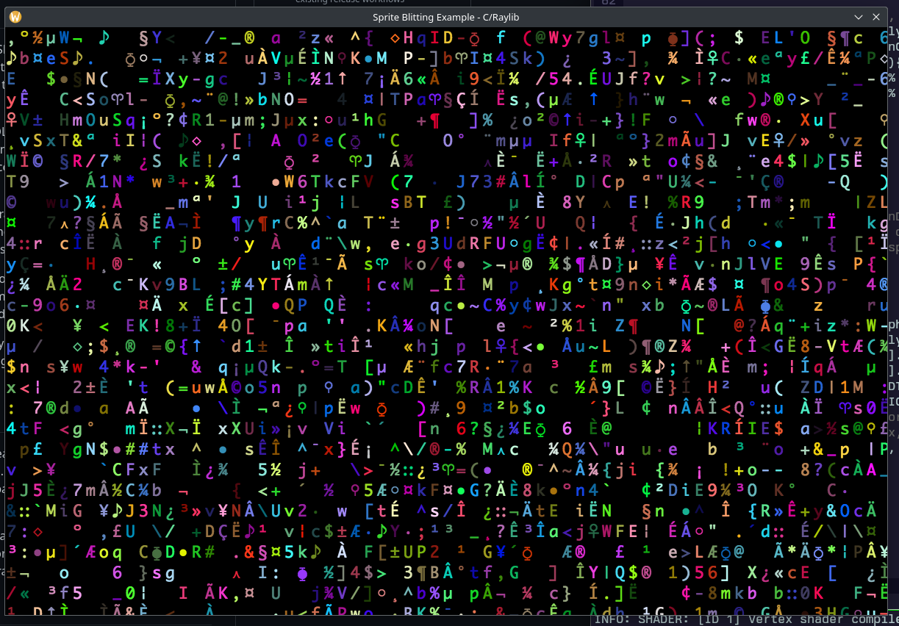

# Sprite Blitting Example, Using Raylib + C

So this is the sprite blitting example that exists in my other repos, i.e.
    - `ysgard/sprite-blitting-c` - SDL2 and C
    - `ysgard/sprite-blitting-d` - SDL2 and D
    - `ysgard/sprite-blitting-rs` - SDL2 and Rust
    - `ysgard/sprite-blitting-zig` - SDL2 and Zig

I thought it would be an interesting exercise to try the sprite blitting 
example using a different library than SDL2, namely one that's become
pretty popular in recent years - [Raylib](https://www.raylib.com/index.html)

Raylib exists in the same space as SDL2 and advertises itself as a 'programming
library to enjoy videogames programming'. To that end it provides a nice 
assortment of functions to perform the basics of game programming, such as
loading textures, drawing shapes, streaming music, etc...

## Porting the Example

It's pretty apparent that Raylib definitely will hold your hand more than SDL2
will - up until the point that it ditches you completely. People will notice
that this example, unlike the others, does not have a colored background for 
the sprites. This is because Raylib's ability to manipulate textures is very 
limited - I could not figure out how to set a particular color to be
transparent.

I also had to restructure the example significantly to get it to work. In SDL2,
what I did was generate a random glyph for each 'cell' in the window, blit it 
to a surface in memory, and then point to that surface to be the rendering
surface - in essence using double-buffering. I'd then wait a second, then redraw
to the other buffer and swap them again.

In Raylib this wasn't possible out-of-the-box. Raylib takes control of the frame
-buffering process and you don't have access to the underlying surface. And even
if you did, Raylib seemingly doesn't provide any way to blit one texture onto
another in memory. You're only allowed to draw to the screen.

The first attempt was to simply draw the glyphs to the screen, wait a second, 
and then redraw. But that led to flickering, because Raylib will swap
framebuffers automatically each frame, so one's got the glyphs, the other
doesn't, and you get flickering. You have to draw each cycle, even if you don't
need to. 

So then I restructured the example as if it were a proper model - an array in
memory held the position on the spritesheet of the current glyph and its current
color, and I'd draw those glyphs to the screen each frame, and updated the array
once a second.

## Conclusion

Raylib is cool. I love how well documented it is, and the examples are great. I
think I'm going to continue using it. My problems with it stem from the way I
way I got used to using SDL2. If I was writing the sprite-blitting example from 
scratch I probably would have taken care to set the transparency on the
spritesheet properly, and used a model from the get-go.

Ray, the creator of Raylib, said himself that this was a library meant to teach
and make game programming fun. And he's certainly done that. He encourages
others to extend the library if it doesn't do what they want, and I'm sure there
must exist texture manipulation extensions to the library somewhere.

## Usage

- Install `gcc` or `clang`, `make` and Raylib.
- Clone this repo: `git clone
  https://github.com/ysgard/sprite-blitting-c-raylib`
- In the directory, run: `make && ./sprite-blitting`
